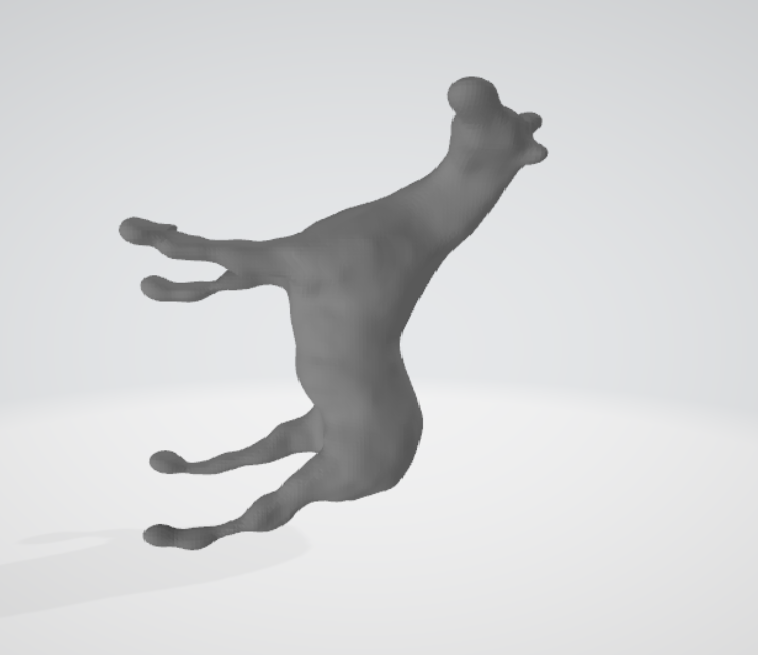

# Poisson Surface Reconstruction

This project is a C++ implementation of Poisson Surface Reconstruction based on the paper `Poisson Surface Reconstruction` by Kazhdan, Bolitho, and Hoppe (2006).

The current pipeline is:

`Octree -> PoissonSolver -> MarchingCubes`

## Overview

- Input: oriented point cloud in `.xyz` format
- Output: reconstructed triangle mesh in `.obj` format
- Main executable: `PoissonSurfaceReconstruction`
- Reference paper text is available locally in the repository root, but it is not part of the commit set used for publishing changes

## Example

Input point cloud:


Reconstructed mesh:



## Repository Layout

- `src/Octree.cpp`: adaptive octree construction, density estimation, and vector-field splatting
- `src/PoissonSolver.cpp`: Poisson solve on the octree basis
- `src/MarchingCubes.cpp`: isosurface extraction and OBJ export
- `resource/points.xyz`: sample input point cloud
- `build/Release/PoissonSurfaceReconstruction.exe`: release executable after a successful build

## Build

This project is currently configured for Windows + Visual Studio with local third-party libraries already included in the repository.

### Configure

```powershell
cmake -S . -B build
```

### Build Release

```powershell
cmake --build build --config Release
```

## Run

From `build/Release`:

```powershell
.\PoissonSurfaceReconstruction.exe ../../resource/points.xyz output.obj 6 4 7
```

Or from the repository root:

```powershell
.\build\Release\PoissonSurfaceReconstruction.exe .\resource\points.xyz output.obj 6 4 7
```

## Command-Line Arguments

```text
PoissonSurfaceReconstruction.exe [input.xyz] [output.obj] [maxDepth] [densityDepth] [extractionDepth]
```

- `input.xyz`: input oriented point cloud
- `output.obj`: output mesh path
- `maxDepth`: maximum octree depth used for reconstruction
- `densityDepth`: depth used for density estimation
- `extractionDepth`: marching-cubes extraction depth

Default behavior in `main.cpp`:

- `input.xyz = ../../resource/points.xyz`
- `output.obj = output.obj`
- `maxDepth = 6`
- `densityDepth = max(maxDepth - 2, 1)`
- `extractionDepth = maxDepth + 1`

## Input Format

The loader expects one point per line in the following format:

```text
x y z nx ny nz
```

- `x y z`: point position
- `nx ny nz`: oriented normal

## Output

The generated OBJ currently contains:

- vertex positions
- face indices

Surface normals are computed during reconstruction, but the current OBJ export path writes positions and faces only.

## Notes

- The implementation is under active refinement against the original paper.
- The current codebase includes octree construction, Poisson solving, and mesh extraction as separate stages, which makes it easier to inspect and improve each stage independently.
